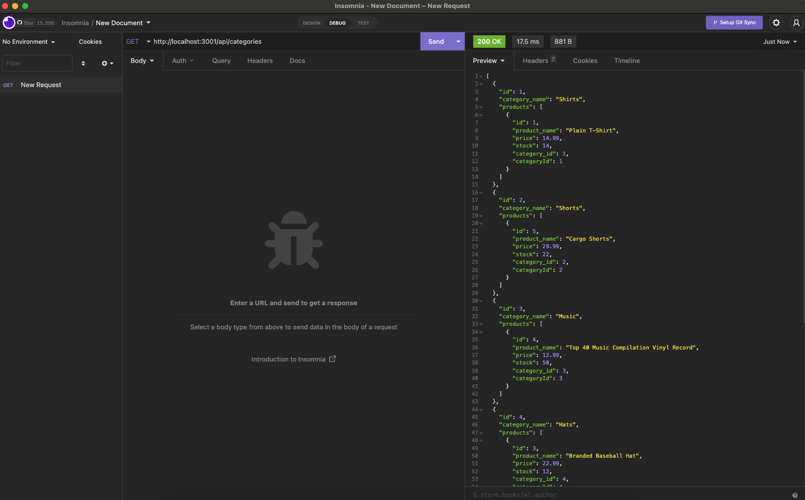

# E-commerce back-end project

## Description

This is a database interaction app to manage inventory for an E-commerce store.

## Table of Contents

- [E-commerce back-end project](#e-commerce-back-end-project)
  - [Description](#description)
  - [Table of Contents](#table-of-contents)
  - [Installation](#installation)
  - [Usage](#usage)
  - [Credits](#credits)
  - [License](#license)
  - [Features](#features)
  - [How to Contribute](#how-to-contribute)
  - [Tests](#tests)
  - [Questions](#questions)

## Installation

This app does require express, mysql, and sequelize.

## Usage

Use this app for managing your inventory!

Link to video: https://drive.google.com/file/d/1w_csS1jl8Z70b8mmLtp31pR1dMSHdQZy/view

## Credits

Sequelize: https://sequelize.org/

## License

This project is under the .

## Features

Enables E-commerce businesses to link their products and categorize them together.

## How to Contribute

Github profile

## Tests

Try using  to try a get, post, put, and delete request.

## Questions

Reach me through my GitHub-rtcottle here: https://github.com/rtcottle
